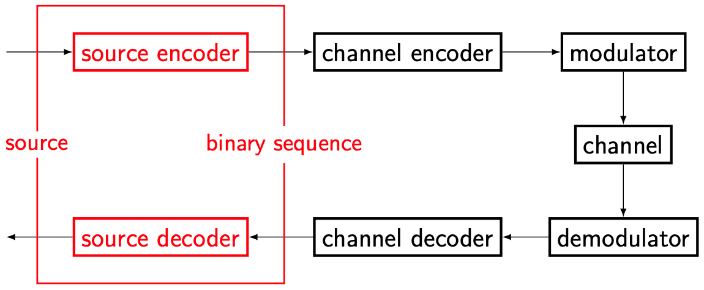

# Basic building blocks

Here is the block diagram of a typical point-to-point communication system. The top row are blocks in the transmitter, and the bottom row are blocks in the receiver.

<figure style="text-align: center;">
  
</figure>

Note that for each block in the transmitter, there is a counterpart in the receiver. Let us divide into each block and discuss their roles.

## Source encoder and source decoder

<figure style="text-align: center;">
  
</figure>

The source encoder "encodes" the message that the transmitter wishes to send. Here, "encodes" includes, but is not limited to, sampling the continuous-time signal to get a discrete-time signal, quantization, and compression.

For example, if we make a phone call, the source is an analog audio signal. Then the source encoder at the transmitter will sample, quantize, and compress the source and output a binary sequence. The source decoder at the receiver will reconstruct the analog audio signal.

Even if the source is already a binary sequence (e.g., a text message that is natively represented by a sequence of bits in our phone), the source encoder is still useful in compressing the original binary sequence into a shorter binary sequence.

Source coding is an important topic in information theory. But we will not dive deep into this topic in this course.

## Channel encoder and channel decoder

<figure style="text-align: center;">
  
</figure>

The channel encoder *adds redundancy* to the binary sequence produced by the source encoding. This might seem counterintuitive -- didn't the source encoder just compress the source signal to *reduce* redundancy?

Well, the source encoder removes the inherent redundancy in the source signal, while the channel encoder adds *a different type of redundancy* to combat the imperfections of the channel. 

We will discuss some simple channel coding and decoding schemes in this course.

## Modulator and demodulator

<figure style="text-align: center;">
  
</figure>

The radio spectrum is a very scarce resource. [Mobile operators spend tens of billions of dollars to buy a few hundred MHz of spectrum](https://www.spglobal.com/marketintelligence/en/news-insights/latest-news-headlines/big-4-wireless-carriers-spent-100b-on-5g-spectrum-was-it-worth-it-68488095).

<i class="fa-solid fa-circle-info fa-xl"></i> **Excerpt from an article by S&P Global**

Verizon, meanwhile, spent $45.45 billion in the C-band spectrum auction in 2021 when the Federal Communications Commission auctioned 280 MHz of spectrum in the 3.7 GHz-3.98 GHz band. AT&T dished out $23.41 billion in the C-band auction and then followed that up by shelling out an additional $9.08 billion in the subsequent 3.45 GHz auction, which ended earlier this month. All told, the carrier spent $32.49 billion on mid-band spectrum across the two auctions.

Therefore, the transmitter needs to carefully "modulate" the signal into the correct frequency band, and the receiver needs to "demodulate" (i.e., retrieve) the signal from the correct band.

Modulation is also important in avoiding *multi-user interference*. For example, in LTE, if two AT&T cell phones are making phone calls in the same room, their signals will be modulated into different frequency bins withint the AT&T spectrum.

Of course, the frequency is not the only degree of freedom. Modulation can place signals in different space and time. We will elaborate on this important topic later.

