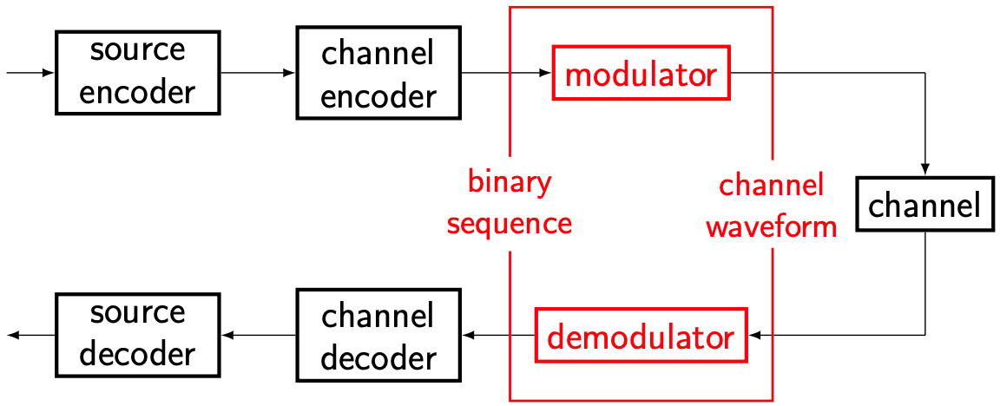

# Key Challenges in Wireless Communications

There are two key challenges in wireless communications:
- *Fading*: The wireless channel is very random. A change of weather or a sudden change in the environment (e.g., people moving around) will change the channel condition. These changes happen in milliseconds or less.
- *Interference*: The signals propagate in the open space, instead of through a conduit such as a cable. Therefore, the receiver gets signals intended for someone else, which are interference to its own communication.

Both challenges are *unique* in wireless communications.

## How to deal with fading?

<figure style="text-align: center;">
  
  <figcaption>The channel encoder and decoder are key modules to deal with fading.</figcaption>
</figure>

As we discussed earlier, the channel encoder adds redundancy to combat the imperfections of the channel. To be specific, the imperfections of the channel refer to fading, among others (e.g., additive noises).

As we will see later, compared to other channel imperfections (e.g., noises), fading is much harder to deal with. Therefore, channel coding is particularly important in wireless communication systems.

## How to deal with interference

<figure style="text-align: center;">
  
  <figcaption>The modulator and demodulator are key modules to deal with multi-user interference.</figcaption>
</figure>

Modulation plays a key role in avoiding *multi-user interference*. We will explore various dimensions of the propagation environment (e.g., space, time, frequency) and discuss how to "arrange" signals from different users so that multi-user interference is minimized.