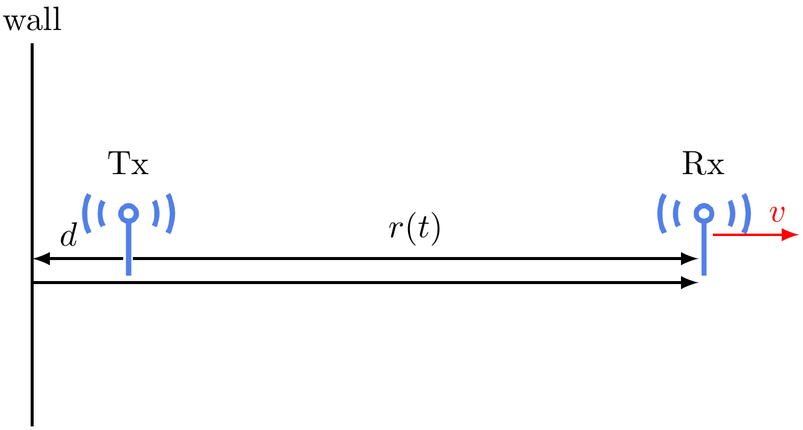
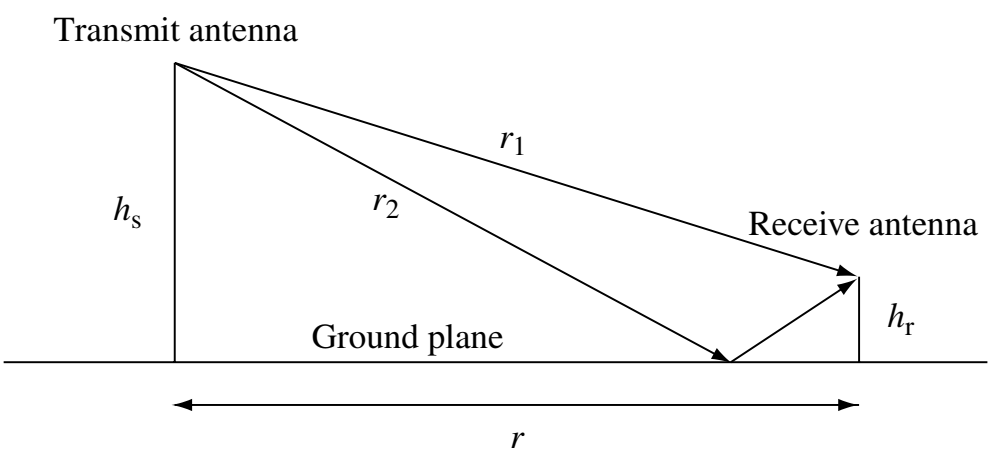

# Physical models of wireless channels

*Please submit your solutions in Laulima.*

## A reflecting wall at the transmitter

We have worked on examples where there is a perfectly reflective wall at the receiver. Now let us assume that the wall is at the transmitter.

<figure style="text-align: center;">
  
</figure>

* (1 point) Derive the analytical expression of the received signal using the ray tracing method.
* (2 points) Following [the procedure here](reading-03-reflecting-wall-fixed-antenna.html), derive the coherence distance, the delay spread, and the coherence bandwidth. Compare them with the example when the wall is at the receiver.
* (2 points) Following [the procedure here](reading-03-reflecting-wall-moving-antenna.html), derive the Doppler spread and the coherence time. Compare them with the example when the wall is at the receiver.

## Reflecting on the ground plane

Consider the scenario where the transmit and receive antennas are at different heights. There is a line-of-sight path and a path where the signal is reflected on the ground.

<figure style="text-align: center;">
  
</figure>

* (1 point) Derive the analytical expression of the received signal using the ray tracing method.
  * We can assume that the ground is a perfect reflector: it does not absorb energy and shifts the phase by \\(180^\circ\\).
  * Please use the heights \\(h_s, h_r\\) and the *horizontal distance* \\(r\\) as the parameters in the expression.
  * You would need to use some geometry to write \\(r_1\\) and \\(r_2\\) as a function of \\(h_s, h_r, r\\).
* (2 points) Write a Python script to draw the energy of the received signal as a function of the horizontal distance \\(r\\) between the transmitter and the receiver. Verify that the power scaling law is roughly \\(r^{-4}\\).
  * You can reuse our code in [the experiential learning](experience-03-fixed-antenna-reflecting-wall.html).
  * You can set the heights of the transmitter and the receiver as \\(h_s=30\\)m and \\(h_r=1\\)m, respectively.
  * Note that we derived the signal. For its power, we need to square it.
  * To verify the scaling law, it may be easier to plot in the log scale.