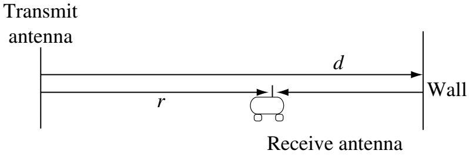

# Case 3: Fixed antennas with a reflecting wall

## Ray tracing

Now consider two antennas with distance \\(r\\) apart on the same horizontal plane (e.g., both on the ground). But there is a wall at distance \\(d\\) away from the transmit antenna.

<figure style="text-align: center;">
  
</figure>

With a reflecting wall, there are two paths for the signal to reach the receiver: the line-of-sight (LOS) path and the path where the signal bounces back from the wall. The received signal is the superpositon of the two rays coming from these two paths. Calculating the received signal by tracing these two rays is called **ray tracing**. This is a commonly-used method to determine the channel quality.

In our case, we already know how to determine the signal coming from the LOS path. For the reflected signal, we can think of it as a signal sent from a virtual transmitter that mirrors the actual transmitter at the other side of the wall. In other words, the virtual transmitter has a distance of \\(2d-r\\) from the receiver. Assuming that the wall is a *perfect reflector*, the received signal has no attenuation from the reflection and has a \\(180^\circ\\) phase shift. Then the received signal is
\\[
  E_r(f,t) = \frac{\alpha \cos 2 \pi f \left[t - r/c\right]}{r} - \frac{\alpha \cos 2 \pi f \left[t - (2d-r)/c\right]}{2d-r}.
\\]
Note that in the above equation, we have the minus operation because of the \\(180^\circ\\) phase shift. Note also that the radiation pattern term is assumed to be a constant \\(\alpha\\) for simplicity.

## Coherence distance, delay spread and coherence bandwidth
From the expression, we know that the received signal is a superposition of two sinusoids. 
* If the two sinusoids have a phase difference that is an even integer multiple of \\(\pi\\), they add up *constructively*. 
* If they have a phase difference that is an odd integer multiple of \\(\pi\\), they add *destructively* or *canel each other*.

Let us formulate this idea mathematically. The phase difference between the two sinusoids is
\\[
  \Delta \theta = \left( \frac{2 \pi f (2d-r)}{c} + \pi \right) - \left( \frac{2 \pi f r}{c} + \pi \right) = \frac{4 \pi f}{c} (d-r) + \pi.
\\]

The two sinusoids go from adding up constructively to canceling each other when the phase difference changes by \\(\pi\\), namely when
\\[
  \frac{4 \pi f}{c} (d-r) = \pi \Rightarrow \frac{4 f}{c} (d-r) = 1.
\\]

This means when the distance \\(r\\) or the frequency \\(f\\) changes a little, the strength of the received signal may change a lot, because the two sinusoids go from being constructive to destructive to each other.

In terms of the distance, the distance from a peak to a valley is defined as **coherence distance**, namely
\\[
  \Delta x_c \triangleq \frac{\lambda}{4},
\\]
where \\(\lambda = c/f\\) is the wavelength. 

In terms of the frequency, the signal strength changes from a peak to a valley when the frequency changes by
\\[
  \frac{1}{2} \left( \frac{2d-r}{c} - \frac{r}{c} \right)^{-1}.
\\]
Notice that the following quantity
\\[
  T_d = \frac{2d-r}{c} - \frac{r}{c},
\\]
is actually the propagation delay of the two paths. This is called **delay spread**.

From the two equations above, we define \\(1/(2T_d)\\) as the **coherence bandwidth**. We can see that the coherence bandwidth is of the order of $1/T_d$.

## Take-away
In wireless communication channels, multipath is common. Multipath creates **delay spread**, resulting in phase differences between signals arriving from different paths. The signals can either add up or canel each other. 

When the distance between the transmitter and the receiver changes by the **coherence distance**, the received signal goes from a peak to a valley.

When the frequency of the signal changes by the **coherence bandwidth**, the received signal goes from a peak to a valley.

Therefore, it is importance to know the coherence distance and the coherence bandwidth of a wireless channel. They tell us how fast the channel changes in the time domain and the frequency domain.