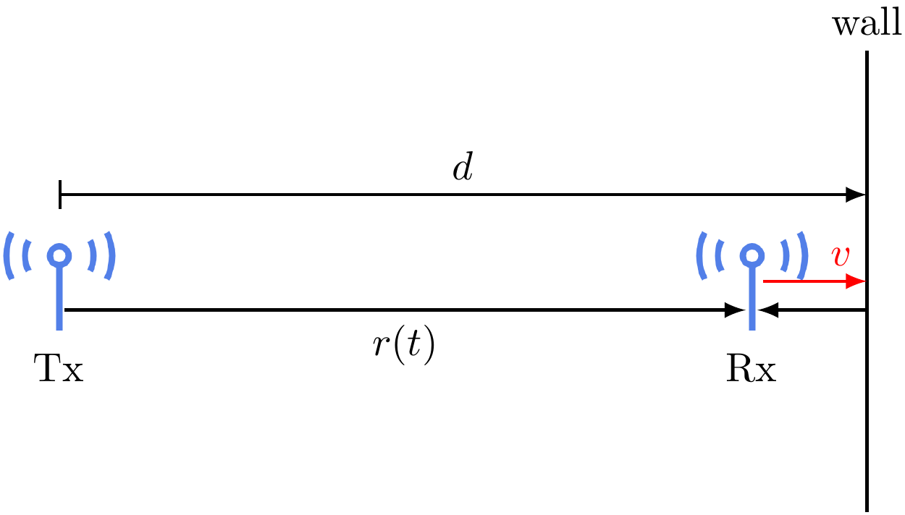
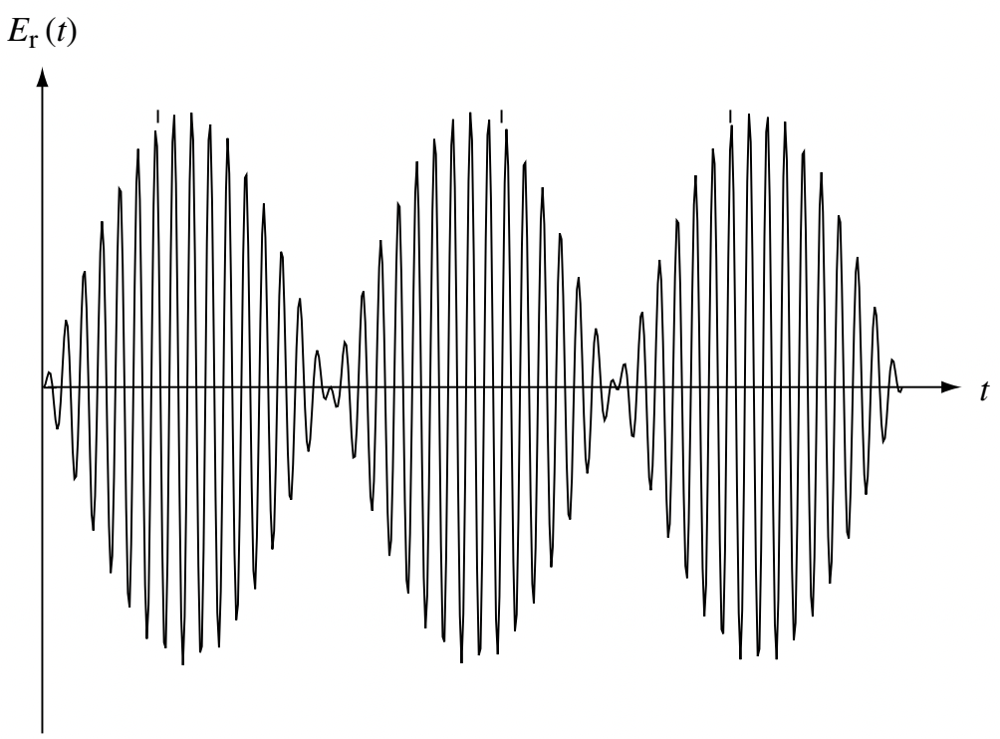

# Case 4: Reflecting wall and moving antennas

## Ray tracing

Continuing from the [previous example](reading-03-reflecting-wall-fixed-antenna.html), now we let the receive antenna move towards the wall at the speed \\(v\\).

<figure style="text-align: center;">
  
</figure>

We need to update the time-varying distance between the two antennas as \\(r(t) = r_0 + vt\\). Using the same ray tracing method, we can calculate the received signal as
\\[
  E_r(f,t) = \frac{\alpha \cos 2 \pi f \left[(1-v/c) t - r_0 / c\right]}{r_0+vt} - \frac{\alpha \cos 2 \pi f \left[(1+v/c)t + (r_0-2d)/c\right]}{2d-r_0-vt}.
\\]

Now assume that the denominators in the above equations are almost the same, namely \\(r_0+vt \approx 2d - r_0 - vt\\). This is true when the receive antenna is close to the wall. Then using the trigonometric identity \\(\cos\theta - \cos\psi = 2 \sin\frac{\theta+\psi}{2} \sin\frac{\psi-\theta}{2}\\), we have 
\\[
  E_r(f,t) \approx \frac{2 \alpha \sin 2 \pi f \left[(v/c) t + (r_0-d) / c\right] \sin 2 \pi f \left(t-d/c\right)}{r_0+vt}.
\\]

We can see that the receive signal is the product of two sinusoids. One sinusoid has the same frequency \\(f\\) as the transmit signal, while the other has a much lower frequency \\(f(v/c)\\), since the moving speed \\(v\\) of the antenna is much slower than the speed of light. For example, at a high moving speed of 40 miles/h (or about 60 km/h) and a frequency of \\(f=3\\) GHz, we have \\(f(v/c) = 600\\) Hz, which is much smaller than the carrier frequency.

<figure style="text-align: center;">
  
</figure>

As illustrated above, the envelop of the receive signal varies at a low frequency of \\(f(v/c)\\), while the signal oscillates at the frequency \\(f\\) within the envelope.

## Doppler spread and coherence time
From the graph of the received signal, we can see that it oscillates between strong and weak at a frequency of \\(f(v/c)\\). This frequency is closely related to Doppler shift. Specifically, due to the movement of the receive antenna, the signal from the line-of-sight path has a frequency of \\(f(1-v/c)\\), experiencing a Doppler shift of \\(D_1 = -fv/c\\), and the signal from the reflected path has a frequency of \\(f(1+v/c)\\), experiencing a Doppler shift of \\(D_2 = +fv/c\\). The difference between the Doppler shifts is defined as **Doppler spread**, namely
\\[
  D_s \triangleq D_2 - D_1.
\\]
In other words, the received signal oscillates at a frequency that equals half of the Doppler spread, namely \\(f(v/c) = D_s/2\\).

Since the strength of the received signal oscillates at the frequency \\(f(v/c)\\), the period of the oscillation is \\(c / (fv)\\). So the time it takes for the signal strength to go from the peak to the valley is 
\\[ 
  c / (4fv),
\\]
which is called **coherence time**.

If you recall, we have defined the coherence distance in the [previous example](reading-03-reflecting-wall-fixed-antenna.html)
\\[
  \Delta x_c \triangleq \frac{\lambda}{4} = \frac{c}{4f}.
\\]
We can see that the coherence time is \\(c / (4fv) = \Delta x_c / v\\). *So the coherence time is exactly the time for the antenna to travel the coherence distance!* Now we have these definitions in a full circle.

## Take-away
Moving antennas result in **Doppler spread**, which is inversely proportional to the **coherence time**. The coherence time is the time for the antenna to travel the **coherence distance**.

Within the coherence time, we can consider the channel as almost constant.