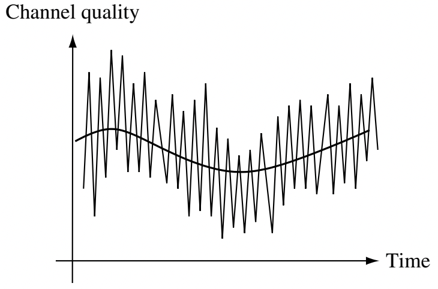

<i class="fa-solid fa-book fa-xl"></i> **Reading in the textbook**

This module covers Section 2.1 of [the textbook](https://web.stanford.edu/~dntse/papers/book121004.pdf).

In this module, we will look at the wireless communication channels from a fundamental level. In particular, we will discuss how a signal propagates from a transmitter to a receiver. 

Theoretically, we can calculate the received signal based on the transmitted signal and the propagation environment using Maxwell's equations. In practice, this approach may be too complicated because the environment is complex.

However, it is useful to apply this approach to very simplified propagation environments. In this way, we can get analytical expressions and great insights about the wireless channels. From these insights, we derive some key concepts that are useful when discussing any wireless channels.

Here is what a typical wireless channel looks like

<figure style="text-align: center;">
  
</figure>

We can see that there are two types of fading (i.e., temporal variations of channel quality)
- *Large-scale fading*: The envelop of the channel quality changes over time, usually in the scale of seconds or minutes.
- *Small-scale fading*: The channel quality also varies very fast, usually in the scale of miliseconds or less.

We will focus more on the small-scale fading, which is more challenging to deal with.
