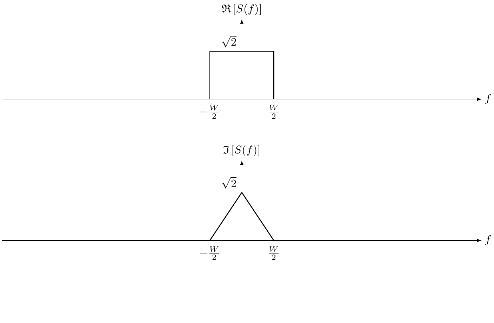

# Input/output models of wireless channels

*Please submit your solutions in Laulima.*

In this assessment, we look at a realistic channel model with its parameters determined by field measurements. Then we will implement a simplified version of this channel model.

One feature of the 5th-generation (5G) wireless communication systems is the usage of the millimeter-wave (mmWave) band at 60 GHz. Therefore, it is crucial to understand the mmWave channels. The Millimetre-Wave Evolution for Backhaul and Access (MiWEBA) project is one of the efforts toward this goal. If you are interested, you might want to take a look at [the complete project report](https://citeseerx.ist.psu.edu/document?repid=rep1&type=pdf&doi=e41ca51b3a590d267f5d09661b790c9002d3abbc).

For this assessment, we will only need to refer to [this paper](https://jwcn-eurasipjournals.springeropen.com/articles/10.1186/s13638-016-0568-6), which summarizes the main findings in channel modeling. You can read through the first two sections to get the background of the study.

We will implement a quasi-deterministic (Q-D) channel model, as illustrated in Fig. 8 of [the paper](https://jwcn-eurasipjournals.springeropen.com/articles/10.1186/s13638-016-0568-6). The Q-D channel consists of a few strong deterministic rays (D-rays) and some random rays (R-rays). Each ray or multipath is a cluster of rays with similar delays. You can look at Fig. 9 of [the paper](https://jwcn-eurasipjournals.springeropen.com/articles/10.1186/s13638-016-0568-6) for an example with two D-rays (i.e., the line-of-sight (LoS) path and the ground reflection path) and two R-rays (i.e., one path due to reflection from a car and the other due to reflection from a building). 

Below are the list of tasks to do.
* Please look at Fig. 3 and Fig. 4, and identify four major multipaths in terms of delay (in ns) and power (in dB).
  - Note that a major multipath should have a relatively high power (i.e., less attenuation). In addition, peaks that are very close to each other can be clustered into one multipath.
* Identify two D-rays and three R-rays. Specify the delay and the power.
* Direct ray
* Ground ray
* Random ray that is reflected from a random reflector (e.g., a car)
* a far wall ray that is reflected from a far reflector (e.g., a building far away from the receiver)

<figure style="text-align: center;">
  
</figure>

* (1 point) Derive the analytical expression of the received signal using the ray tracing method.
* (2 points) Following [the procedure here](reading-03-reflecting-wall-fixed-antenna.html), derive the coherence distance, the delay spread, and the coherence bandwidth. Compare them with the example when the wall is at the receiver.
* (2 points) Following [the procedure here](reading-03-reflecting-wall-moving-antenna.html), derive the Doppler spread and the coherence time. Compare them with the example when the wall is at the receiver.

