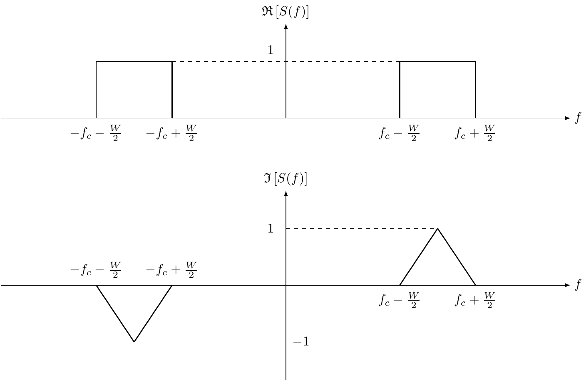

# The baseband equivalent model

Most wireless communication systems send signals at the gigahertz (GHz) frequency. The GHz-frequency spectrum utilized by a wireless communication system is called the **passband**. However, at the base stations and mobile devices, most signal processing (e.g., coding/decodiing, modulation/demodulation) is done in the **baseband**, a spectrum centered around zero frequency. Why we process the signals in the baseband and send them in the passband? There are at least two major advantages of this approach.
  * Interoperability: This approach allows us to have the same baseband signal processing chips for different mobile carriers (e.g., T-Mobile, Verizon), who have separate spectrums. If we were to do signal processing directly in the passband, we would need different processors for different carriers, and the processors would not work when the carrier changes the spectrum (e.g., upgrading from 4G to 5G).
  * Complexity: The signal processing must be done at an extremely high speed if we process the high-frequency passband signals directly.

Therefore, we *upconvert* the baseband signal to the passband before sending it from the transmitter, and *downconvert* the passband signal to the baseband after receiving it at the receiver.

## Conversion of baseband and passband signals

### Review of Fourier transform

Recall that for any complex-valued signal $s(t)$, the Fourier transform and the inverse Fourier transform are defined as

$$
\begin{align}
  S(f) &= \int_{-\infty}^\infty s(t) e^{-j 2 \pi f t} dt \\
  s(t) &= \int_{-\infty}^\infty S(f) e^{j 2 \pi f t} df
\end{align}
$$

For our discussion, we need the following properties of the Fourier transform:
  * For any real-valued signal $s(t)$, we have $S(-f) = S^*(f)$. In other words, its spectrum in the negative frequencies is the conjugate of the spectrum in the positive frequencies.
  * The Fourier transform of $s(t) e^{j 2 \pi f_c t}$ is $S(f-f_c)$. In other words, phase shift in the time domains leads to frequency shift in the frequency domain.

### How to convert between baseband and passband?

<figure style="text-align: center;">
  
</figure>

**passband** $\left[ f_c - W/2, f_c + W/2 \right]$ of bandwidth $W$ around a center frequency $f_c$. The passband is usually in the gigahertz (GHz) spectrum. However, most signal processing (e.g., coding/decodiing, modulation/demodulation) is done in the **baseband** $\left[ -W/2, W/2 \right]$ 

From the figure, we can see that the passband spectrum $S(f)$ can be written in terms of the baseband spectrum $S_b(f)$ as follows
\\[
  S(f) = \frac{1}{\sqrt{2}} \left[ S_b(f-f_c) + S_b^*(-f-f_c) \right].
\\]

Using the properties of the Fourier transform, we can obtain the following relationship between the passband signal and the baseband signal

$$
\begin{align}
  s(t) &= \frac{1}{\sqrt{2}} \left[ s_b(t) e^{j 2 \pi f_c t} + s_b^*(t) e^{-j 2 \pi f_c t} \right] \notag\\
       &= \sqrt{2} \mathfrak{R}\left[s_b(t)\right] \cos 2 \pi f_c t - \sqrt{2} \mathfrak{I}\left[s_b(t)\right] \sin 2 \pi f_c t \label{eqn:upconversion}
\end{align}
$$

From \eqref{eqn:upconversion}, we can see how we can upconvert or modulate the baseband signal to the passband. In particular, we can have two streams of signals, which are regarded as the real part $\mathfrak{R}\left[s_b(t)\right]$ and the imaginary part $\mathfrak{I}\left[s_b(t)\right]$ of a complex baseband signal $s_b(t)$. Then we multiply the real part by $\sqrt{2} \cos{2 \pi f_c t}$ and the imaginary part by $-\sqrt{2} \sin{2 \pi f_c t}$, and sum up the products.

\\[
  s(t) = \sqrt{2} \mathfrak{R}\left[ s_b(t) e^{j 2 \pi f_c t} \right]
\\]

## Equivalent baseband channel model
Based on the above analysis, we can consider the channel as a linear time-varying filter. The input/output relationship of the filter can be written as
\\[
  y(t) = \int_{-\infty}^{\infty} h(\tau, t) x(t-\tau) d\tau,
\\]
where the impulse response is
\\[
  h(\tau,t) = \sum_{i} a_i(t) \delta(\tau - \tau_i(t)).
\\]

$$
\begin{align}
  y(t)  & = \sum_i a_i(t) x(t - \tau_i(t)) \notag\\
        & = \sum_i a_i(t) \left\{ \sqrt{2} \mathfrak{R}\left[ x_b(t - \tau_i(t)) e^{j 2 \pi f_c (t - \tau_i(t))} \right] \right\} \notag\\
        & = \sqrt{2} \mathfrak{R}\left[ \sum_i a_i(t) x_b(t - \tau_i(t)) e^{j 2 \pi f_c (t - \tau_i(t))} \right] \notag\\
        & = \sqrt{2} \mathfrak{R}\left[ \sum_i a_i(t) e^{-j 2 \pi f_c \tau_i(t)} x_b(t - \tau_i(t)) e^{j 2 \pi f_c t} \right] \notag\\
        & = \sqrt{2} \mathfrak{R}\left[ \left( {\color{red} \sum_i \left( a_i(t)  e^{-j 2 \pi f_c \tau_i(t)} \right) x_b(t - \tau_i(t)) } \right) e^{j 2 \pi f_c t} \right] \label{eqn:passband-receive-signal-1}
\end{align}
$$

\begin{align}
  y(t) = \sqrt{2} \mathfrak{R}\left[ {\color{red} y_b(t)} e^{j 2 \pi f_c t} \right] \label{eqn:passband-receive-signal-2}
\end{align}

Now comparing \eqref{eqn:passband-receive-signal-1} and \eqref{eqn:passband-receive-signal-2}, we can see that the red parts should be the same, which gives us the input/output model of the baseband channel

$$
 y_b(t) = \sum_i \left( a_i(t)  e^{-j 2 \pi f_c \tau_i(t)} \right) x_b(t - \tau_i(t)).
$$

<!--

  

    $$
      h_b(\tau;t) = \sum_{i} a_i^b(t) \delta(\tau - \tau_i(t)),
    $$
  

\begin{empheq}[]{equation*}
    c_i = \langle\psi|\phi\rangle
\end{empheq}

  <strong>Heads up!</strong> This <a href="#" class="alert-link">alert needs your attention</a>, but it's not super important.

-->

Similar to [the case in the passband](reading-04-linear-time-varying-system.html), we can define the **baseband equivalent channel model** as
\\[
  h_b(\tau,t) = \sum_{i} a_i^b(t) \delta(\tau - \tau_i(t)),
\\]
where the tap gain is
$$
  a_i^b(t) = a_i(t)  e^{-j 2 \pi f_c \tau_i(t)}.
$$

In other words, the baseband equivalent chanenl model is *also a FIR filter, but with complex-valued tap gains!* The tap gains are complex-valued because the baseband signals are complex-valued.