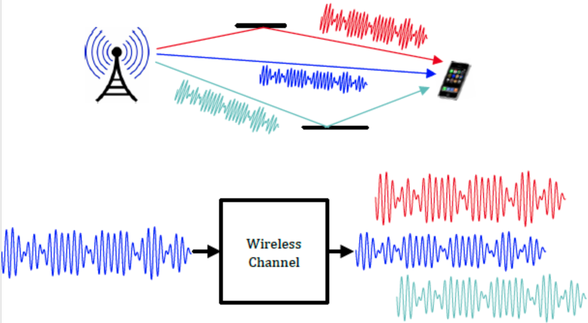

# The baseband equivalent model

## Summarizing the physical models

If we review the physical models in the previous module, we can find a pattern. Specifically, for the sinusoid transmit signal \\(\phi(t) = \cos 2\pi f t\\), the receive signal can always be written as
\\[
  \sum_{i} a_i(f,t) \phi(t - \tau_i(f,t)).
\\]

Take the most complex model, namely moving antennas with a perfectly reflecting wall, as an example. The received signal is
\\[
  E_r(f,t) = \frac{\alpha \cos 2 \pi f \left[(1-v/c) t - r_0 / c\right]}{r_0+vt} - \frac{\alpha \cos 2 \pi f \left[(1+v/c)t + (r_0-2d)/c\right]}{2d-r_0-vt}.
\\]

As complicated as it seems, we can cast it in the general form by setting
\\[
  a_1(t) = \frac{\alpha}{r_0+vt}, ~~ \tau_1(t) = \frac{r_0+vt}{c}
\\]
and
\\[
  a_2(t) = \frac{\alpha}{2d-r_0-vt}, ~~ \tau_2(t) = \frac{2d-r_0-vt}{c} - \frac{1}{2f},
\\]
where the \\(\frac{1}{2f}\\) term in \\(\tau(t)\\) comes from the \\(180^\circ\\) phase shift in the reflected signal.

In summary, the received signal is the weighted sum of sinusoids with different delays.

In practice, the transmit signal is not a sinusoid. But any practical transmit signal can be viewed as a superpositon of sinusoids of different frequencies. Therefore, for any transmit signal \\(x(t)\\)), the above linear relationship is preserved. In other words, we can write the receive signal \\(y(t)\\) as
\\[
  y(t) = \sum_i a_i(t) x(t-\tau_i(t)).
\\]

Hence, the wireless channel "produce" multiple delayed versions of the transmit signal from multipath and adds them all up at the receiver:

<figure style="text-align: center;">
  
</figure>

Both the weight \\(a_i(t)\\) and the delay \\(\tau_i(t)\\) depend on the distance of the path. In addition, the weight also depends on the radiation patterns of the antennas. But this factor is assumed to be fixed. The delay \\(\tau_i(t)\\) may also depend on the phase shift when the signal is reflected from a surface.

## The linear time-varying system model
Based on the above analysis, we can consider the channel as a linear time-varying filter. The input/output relationship of the filter can be written as
\\[
  y(t) = \int_{-\infty}^{\infty} h(\tau, t) x(t-\tau) d\tau,
\\]
where the impulse response is
\\[
  h(\tau,t) = \sum_{i} a_i(t) \delta(\tau - \tau_i(t)).
\\]

This is a very useful and commonly-used view of the wireless channel: it is a finite impulse response (FIR) filter with time-varying tap gains!
