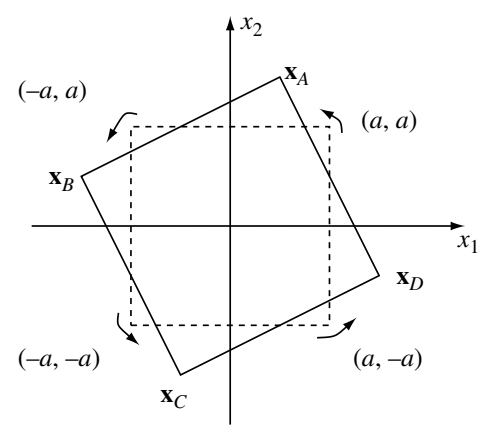

# Beyond repetition coding

We have used [repetition coding to achieve the diversity gain](reading-06-performance-gain-time-diversity.html/), where the error rate decays with $\textsf{SNR}^{-L}$. However, the diversity gain is achieved by repeating the same symbol in $L$ time slots, reducing the effective data rate by $L$. Can we achieve the diversity gain without decreasing the data rate?

We are indeed able to achieve the diversity gain while keeping the data rate. We will show how to achieve it using a *rotation code* in the case of $L=2$.

## Rotation code

To put things into perspective, we have studied two cases at the opposite ends of the spectrum:
  * maximum diversity gain with reduced data rate, by sending *completely correlated* symbols (i.e., the same symbol over $L$ time slots)

  $$
    y_\ell = h_\ell x + w_\ell, \quad \ell=1,\ldots,L.
  $$

  * no diversity gain with normal data rate, by sending *completely uncorrelated* symbols

  $$
    y_\ell = h_\ell x_\ell + w_\ell, \quad \ell=1,\ldots,L.
  $$

In the first case, the diversity gain is achieved through the perfect correlation between symbols, so that we can recover the symbol even if deep fading is experienced in some, but not all, time slots. So a natural idea is to send different symbols in different time slots, but introduce some correlation among them. In this way, we may be able to achieve the diversity gain with the same data rate.

One way to introduce correlation is to use a rotation code, illustrated below for the case of $L=2$:

<figure style="text-align: center;">
  
</figure>

In binary phase shift keying (BPSK), the four possible tuples of symbols $(x_1, x_2)$ are the four vertices of an upright square, namely $(a,a), (-a,a), (-a,-a), (a,-a)$. In the rotation code, we rotate the square and use the four vertices of the rotated square. This introduces some correlation: if $x_1$ is positive and has a large value, then $\mathbf{x}_D$ is more likely than $\mathbf{x}_A$, indicating that $x_2$ is more likely to be $-a$.

Next, we analyze the performance of rotation coding.

## Performance of rotation coding

Again, due to symmetry, we can focus on the case where $\mathbf{x}_A$ was sent but was mistaken for other symbols by the detector. Then we can bound the error probability by the union bound

$$
p_e \leq \mathbf{P}\left(\mathbf{x}_A \rightarrow \mathbf{x}_B\right) + \mathbf{P}\left(\mathbf{x}_A \rightarrow \mathbf{x}_C\right) + \mathbf{P}\left(\mathbf{x}_A \rightarrow \mathbf{x}_D\right),
$$

where $\mathbf{P}\left(\mathbf{x}_A \rightarrow \mathbf{x}_B\right)$ is the pairwise error probability of choosing $\mathbf{x}_B$ when $\mathbf{x}_A$ was sent and when $\mathbf{x}_A$ and $\mathbf{x}_B$ are the only two symbols. By using the union bound, we can reuse the [result on the error probability of binary detection](reading-06-performance-gain-time-diversity.html/), namely 

$$
\mathbf{P}(\text{error} \vert \mathbf{h}) = Q\left( \frac{\Vert \mathbf{u}_A - \mathbf{u}_B \Vert}{2 \sqrt{N_0 / 2}} \right).
$$

Now we need to determine $\mathbf{u}_A$ and $\mathbf{u}_B$ in the rotation code.

The rotation can be expressed by the multiplication with the rotation matrix. Specifically, if we rotate the square counterclock wise by $\theta$, the rotation matrix is defined as

$$
\mathbf{R} = \left[ \begin{array}{cr} \cos\theta & -\sin\theta \\ \sin\theta & \cos\theta \end{array} \right],
$$

and the four symbols are 

$$
\mathbf{x}_A = \mathbf{R} \left[ \begin{array}{c} a \\ a \end{array} \right], \quad
\mathbf{x}_B = \mathbf{R} \left[ \begin{array}{c} -a \\ a \end{array} \right], \quad
\mathbf{x}_B = \mathbf{R} \left[ \begin{array}{c} -a \\ -a \end{array} \right], \quad
\mathbf{x}_C = \mathbf{R} \left[ \begin{array}{c} a \\ -a \end{array} \right].
$$

Focusing on $\mathbf{x}_A$ and $\mathbf{x}_B$, the exact expressions of them are

$$
\mathbf{x}_A = \left[ \begin{array}{c} a \cos\theta - a \sin\theta \\ a \sin\theta + a \cos\theta \end{array} \right] \quad \text{and} \quad \mathbf{x}_B = \left[ \begin{array}{c} -a \cos\theta - a \sin\theta \\ -a \sin\theta + a \cos\theta \end{array} \right]
$$

Therefore, we have

$$
\mathbf{u}_A = \left[ \begin{array}{c} h_1 x_{A1} \\ h_2 x_{A2} \end{array} \right]
\quad \text{and} \quad
\mathbf{u}_B = \left[ \begin{array}{c} h_1 x_{B1} \\ h_2 x_{B2} \end{array} \right]
$$

Then the pairwise error probability is

$$
\mathbf{P}\left(\mathbf{x}_A \rightarrow \mathbf{x}_B\right \vert h_1, h_2) = Q\left( \frac{\Vert \mathbf{u}_A - \mathbf{u}_B \Vert}{2 \sqrt{N_0 / 2}} \right) = Q\left( \sqrt{2 \textsf{SNR} \left[ \vert h_1 \vert^2 (\cos\theta)^2 + \vert h_2 \vert^2 (\sin\theta)^2 \right]} \right).
$$

Taking into account the distribution of the channel gains $h_1$ and $h_2$, the average error probability satisfies

$$
\mathbf{P}\left(\mathbf{x}_A \rightarrow \mathbf{x}_B\right) = \mathbb{E}_{h_1,h_2} \left[ Q\left( \sqrt{2 \textsf{SNR} \left[ \vert h_1 \vert^2 (\cos\theta)^2 + \vert h_2 \vert^2 (\sin\theta)^2 \right]} \right) \right] \leq \left( \frac{1}{1 + \textsf{SNR} (\cos\theta)^2} \right) \left( \frac{1}{1 + \textsf{SNR} (\sin\theta)^2} \right).
$$

Now we can see that the error probability is bounded by $\textsf{SNR}^{-2}$, as long as $\cos\theta \neq 0$ and $\sin\theta \neq 0$.

Therefore, the rotation code achieves an error decay of $\textsf{SNR}^{-2}$ while transmitting two different symbols in two time slots!
